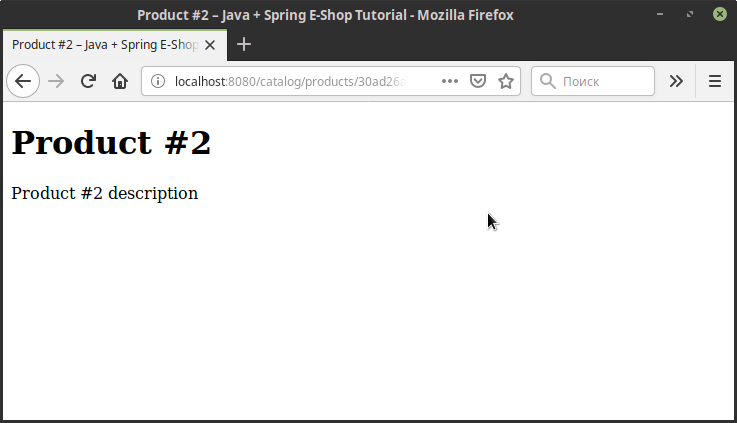

# Начало разработки веб-приложений с Java и Spring
В этом цикле статей я опишу процесс разработки веб-приложения на Java и Spring на примере разработки простого 
интеренет-магазина. Цикл статей разбит таким образом, чтобы в каждой статье описывался процесс работы с одной 
технологией или с одной группой взаимосвязанных технологий.

Список статей цикла (будет обновляться):
* Начало разработки веб-приложений с Java и Spring
* Асинхронные запросы и REST
* Spring и работа с базами данных
* Управление доступом в веб-приложениях с Spring Security

## Подготовка проекта
Как уже было написано выше, в статье я буду разбирать процесс разработки простого интернет-магазина. Для разработки 
проекта я буду использовать Spring Boot, поскольку данный фреймворк позволяет разрабатывать приложения со Spring быстро,
минимизируя время, затрачиваемое на конфигурирование контекста приложения, и минимизируя возможные конфликты 
зависимостей.

В рамках данной статьи потребуются следующие зависимости:
* `spring-boot-starter-web` в качестве основы веб-приложения на Servlet API
* `spring-boot-starter-thymeleaf` для интеграции Thymeleaf в качестве библиотеки шаблонизации
* `spring-boot-starter-test` для тестов

`pom.xml` будет выглядеть примерно следующим образом:

```xml
<project>

    <dependencies>
        <dependency>
            <groupId>org.springframework.boot</groupId>
            <artifactId>spring-boot-starter-thymeleaf</artifactId>
        </dependency>
        <dependency>
            <groupId>org.springframework.boot</groupId>
            <artifactId>spring-boot-starter-web</artifactId>
        </dependency>
        <dependency>
            <groupId>org.springframework.boot</groupId>
            <artifactId>spring-boot-starter-test</artifactId>
            <scope>test</scope>
        </dependency>
    </dependencies>

    <build>
        <plugins>
            <plugin>
                <groupId>org.springframework.boot</groupId>
                <artifactId>spring-boot-maven-plugin</artifactId>
            </plugin>
        </plugins>
    </build>

</project>
```

Код `pom.xml` и остальных файлов в этой статье преднамеренно минимизирован, полная версия доступна в репозитории. 

## Разработка веб-приложения с архитектурой MVC
Главный элемент практически любого интернет-магазина - каталог товаров, давайте разработаем страницы списка товаров и 
описания товара.

Для начала создадим класс, описывающий товар - Product:
```java
public class Product {
    
    UUID id;
    String title;
    String description;
}
```

В подавляющем большинстве приложений мы получаем данные из источников данных при помощи специальных 
классов-репозиториев. Для списка товаров мы создадим простой класс-репозиторий, который будет хранить товары в списке:

```java
import org.springframework.stereotype.Repository;

@Repository
public class ProductRepository {
    List<Product> products;
}
```
Аннотация `@Repository` нужна для автоматической регистрации компонента класса `ProductRepository` в контексте 
приложения.

Теперь можем создать контроллер, который будет обрабатывать поступающие запросы - ProductController:
```java
import org.springframework.stereotype.Controller;
import org.springframework.web.bind.annotation.RequestMapping;

@Controller
@RequestMapping("catalog/products")
public class ProductController {
    
    ProductRepository productRepository;
}
```

Аннотация `@Controller` тоже нужна для автоматической регистрации компонента класса `ProductController` в контексте 
приложения. Он будет создан и зарегистрирован в контексте автоматически при запуске приложения.

> Регистрация компонентов приложения при помощи аннотаций не является самой оптимальной с точки зрения эффективности 
использования ресурсов, но позволяет конфигурировать контекст приложения более наглядно.

Аннотация `@RequestMapping` указывает, что данный класс-контроллер обрабатывает HTTP-запросы, путь которых начинается с 
`/catalog/products`.


### Страница списка товаров
Теперь для страницы списка товаров создадим метод `findAll` в `ProductRepository`, который потребуется для получения 
всех товаров из репозитория:

```java
public class ProductRepository {
    List<Product> findAll() {
        return this.products;
    }
}
```

В классе `ProductController` создадим метод, который будет обрабатывать запрос на получение страницы списка товаров:

```java
import org.springframework.http.HttpStatus;
import org.springframework.web.bind.annotation.GetMapping;
import org.springframework.web.servlet.ModelAndView;

@Controller
@RequestMapping("catalog/products")
public class ProductController {
    
    @GetMapping("list")
    ModelAndView list() {
        return new ModelAndView("catalog/products/list", 
            Map.of("products", this.productRepository.findAll()), 
            HttpStatus.OK);
    }
}
```

Аннотация `@GetMapping` указывает, что метод `list` обрабатывает запросы к сегменту пути `list`. Полный путь, 
который обрабатывает этот метод, складывается из пути, указанного в аннотации `@RequestMapping` класса 
`ProductController`, и пути, указанного в `@GetMapping` метода. Таким образом метод `list` обрабатывает запросы с путём 
`/catalog/products/list`.

> Аннотации `@GetMapping`, `@PostMapping` и т.д. являются упрощенными альтернативами аннотации `@RequestMapping`. Таким 
образом вместо `@GetMapping` можно написать `@RequestMapping(method = RequestMethod.GET)`

Метод `list` возвращает объект класса `ModelAndView`, который передаёт имя отображаемого шаблона, модель, содержащую
список товаров в аттрибуте `product`, и HTTP-статус `200 OK`.

Теперь можно создать шаблон страницы. Мы указали, что метод `list` возвращает шаблон с именем `catalog/products/list`,
соответственно, нам для этого необходимо в директории ресурсов создать структуру директорий `templates/catalog/products`
и файл `list.html` в ней.

> Директория `templates` в директории ресурсов является директорией по умолчанию для шаблонов в веб-приложениях, 
использующих Spring Boot. Вместо этой директории можно указать другое место при помощи настроек шаблонизатора, например 
для Thymeleaf - `spring.thymeleaf.prefix`

Шаблон страницы будет очень простым и будет содержать список ссылок на страницы товаров:
```html
<!DOCTYPE html>
<html lang="en">
<head>
    <meta charset="UTF-8"/>
    <title>Catalog &#8211; Java + Spring E-Shop Tutorial</title>
</head>
<body>
<h1>Catalog</h1>
<ul>
    <li data-th-each="product : ${products}" class="product">
        <a data-th-href="@{/catalog/products/{productId}(productId=${product.id})}"
           data-th-text="${product.title}"></a>
    </li>
</ul>
</body>
</html>
```

Вместо специфичных для Thymeleaf аттрибутов используются аттрибуты, начинающиеся с `data-th-`. Это позволяет не 
использовать XML-схему Thymeleaf. Например, для генерирования аттрибута `href` используется `data-th-href` вместо 
`th:href`.

Если мы заполним репозиторий тестовыми данными, запустим приложение (например, при помощи Maven: `mvn spring-boot:run`)
и откроем страницу `http://localhost:8080/catalog/products/list`, то увидим примерно такую страницу:


### Тестирование
Тестирование является важной и неотъемлемой частью разработки качественного ПО, оно позволяет ещё на этапе разработки
отсеять большую часть возможных ошибок. Существует несколько способов тестирования, среди которых основные - модульное и
интеграционное тестирование.

> Как правило, различные способы тестирования являются взаимодополняющими, а не взаимоисключающими, даже если они они 
содержат одни и те же проверки.

Библиотека `spring-boot-starter-test` предоставляет богатый инструментарий для модульного и интеграционного тестирования
приложений, использующих Spring. Никаких дополнительных зависимостей нам на данный момент не потребуется.

> В модульных тестах каждый компонент тестируется изолированно, а поведение связанных компонентов имитируется. В 
интеграционных тестах тестируется поведение системы в целом, включая взаимодействие между компонентами.

В первую очередь давайте напишем модульный тест для метода `list` класса `ProductController`. Поскольку в данном методе 
отсутствуют ветвления, тест будет очень простой:

```java
public class ProductsControllerTest {

    @Test
    public void list_ReturnsValidModelAndView() {
        // given
        List<Product> products = IntStream.range(1, 4)
                .mapToObj(i -> new Product(UUID.randomUUID(), "Product #" + i,
                        "Product #" + i + " description"))
                .collect(Collectors.toList());

        ProductRepository productRepository = Mockito.mock(ProductRepository.class);
        Mockito.doReturn(products).when(productRepository).findAll();

        ProductsController productsController = new ProductsController(productRepository);

        // when
        ModelAndView modelAndView = productsController.list();

        // then
        Assert.assertNotNull(modelAndView);
        Assert.assertEquals(products, modelAndView.getModel().get("products"));
        Assert.assertEquals("catalog/products/list", modelAndView.getViewName());
        Assert.assertEquals(HttpStatus.OK, modelAndView.getStatus());

        Mockito.verify(productRepository).findAll();
    }
}

```

Я комментариями разделил код теста на три части: описание исходных условий (given), вызов тестируемого метода (when) и 
проверку результата (then). Каждый тест имеет минимум две части: вызов и проверку результата.

В части, где описываются исходные условия, я создал мок-объект для класса `ProductRepository` и указал, что должен 
вернуть его метод `findAll`. Я мог бы использовать реальный объект этого класса, но тогда это нарушало бы принцип 
изолированности тестирования, поскольку тест начал бы зависеть от поведения `ProductRepository`.

В части, где описываются проверки, я проверил полученный объект класса `ModelAndView` на соответствие нужным критериям
при помощи статических методов класса `Assert` и проверил, что был вызван метод `ProductRepository.findAll()` при помощи
метода `Mockito.verify()`.

На этом написание модульного теста завершено. Если мы запустим тест, то он должен завершиться успешно. Теперь можно 
перейти к написанию интеграционного теста. В нём мы будем тестировать HTTP-вызов к нашему веб-приложению и проверять 
полученный ответ. Заготовка класса интеграционных тестов для приложения на основе Spring Boot выглядит следующим 
образом:

```java
import org.junit.runner.RunWith;
import org.springframework.boot.test.context.SpringBootTest;
import org.springframework.test.context.junit4.SpringRunner;

@RunWith(SpringRunner.class)
@SpringBootTest
public class ProductControllerIntegrationTest {
    
}
```

Для интеграционного тестирования нам понадобится `MockMvс`, при помощи которого будут имитироваться HTTP-вызовы к 
приложению. Мы можем создать этот объект самостоятельно, а можем отметить класс `ProductControllerIntegrationTest` 
аннотацией `@AutoConfigureMockMvc`, а затем внедрить объект класса `MockMvc` через свойство при помощи аннотации 
`@Autowired`. Аналогично нему мы внедрим объект класса `ProductRepository`, чтобы в рамках интеграционного теста можно 
было наполнить репозиторий тестовыми данными, но для него будем использовать аннотацию `@SpyBean`, которая позволит
отслеживать вызовы его методов.

```java
import org.springframework.beans.factory.annotation.Autowired;
import org.springframework.boot.test.autoconfigure.web.servlet.AutoConfigureMockMvc;
import org.springframework.test.web.servlet.MockMvc;
import org.springframework.boot.test.mock.mockito.SpyBean;

@RunWith(SpringRunner.class)
@SpringBootTest
@AutoConfigureMockMvc
public class ProductsControllerIntegrationTest {

    @Autowired
    MockMvc mockMvc;
    
    @SpyBean
    ProductRepository productRepository;
}
```

> На практике лучше предпочитать внедрение зависимости через конструктор или set-метод вместо внедрения через свойство.
Но при написании тестов допустимо внедрение зависимостей и через свойство.

Теперь в тестовом методе при помощи объекта класса `MockMvc` мы можем сымитировать HTTP-вызов и проверить валидность 
ответа от приложения. Интеграционный тест будет выглядеть следующим образом:

```java
@RunWith(SpringRunner.class)
@SpringBootTest
@AutoConfigureMockMvc
public class ProductsControllerIntegrationTest {

    @Autowired
    MockMvc mockMvc;

    @SpyBean
    ProductRepository productRepository;

    @Test
    public void list_ReturnsProductsListPage() throws Exception {
        // given
        List<Product> products = IntStream.range(1, 4)
                .mapToObj(i -> new Product(UUID.randomUUID(), "Product #" + i,
                        "Product #" + i + " description"))
                .collect(Collectors.toList());

        this.productRepository.getProducts().addAll(products);

        // when
        this.mockMvc.perform(MockMvcRequestBuilders.get("/catalog/products/list"))
                // then
                // проверим, что статус 200
                .andExpect(MockMvcResultMatchers.status().isOk())
                // модель содержит список товаров
                .andExpect(MockMvcResultMatchers.model().attribute("products", products))
                // имя шаблона соответствует ожидаемому
                .andExpect(MockMvcResultMatchers.view().name("catalog/products/list"))
                // на странице есть три элемента <li> с аттрибутом class='product"
                .andExpect(MockMvcResultMatchers.xpath("//li[@class='product']").nodeCount(3));

        Mockito.verify(this.productRepository).findAll();
    }
}
```

Как и в случае с модульным тестом, код разделён на все те же три части: исходные условия, обращение к тестируемому 
методу и проверка результата. Обращу внимание на то, что для XPath-проверок требуется, чтобы возвращённая страница была
XML-валидной, иначе будет выброшена ошибка, связанная с парсингом документа.

Если требуется более детальное тестирование HTML-страниц, то лучше обратиться к `WebDriver` или `HtmlUnit`, для которых
предусмотрена интеграция с `MockMvc`.

> Я преднамеренно не стал описывать тесты для `ProductRepository`, так как этот класс существует только в качестве 
примера. Тесты репозиториев будут описаны в одной из следующих статей, в которых речь пойдёт о работе с реальными
базами данных.

## Страница с описанием товара
Теперь можно разработать страницу с описанием товара. Но на этот раз мы будем вести разработку через тестирование, иными
словами мы сначала напишем тесты, а уже после этого напишем код, который будет проходить эти тесты.

### Написание тестов

Логичнее начать с написания интеграционного теста, так как им мы охватываем сразу все компоненты приложения, 
задействованные при обработке вызова. Более того, условия прохождения интеграционных тестов описываются более 
"человеческим" языком, чем условия модульных тестов.

Обработка запроса на получение страницы с описанием товара может пойти по двум сценариями, и мы можем их описать:
1. Если товар с запрашиваемым идентификатором существует, то должна быть отображена страница с описанием товара и со 
статусом 200 OK
2. Если товар с запрашиваемым идентификатором не существует, то должна быть отображена страница с ошибкой и со статусом
404 Not Found

Мы можем протестировать оба сценария в одном тестовом методе, но удобнее будет написать для каждого сценария отдельный
тестовый метод. Предполагается, что наш будущий метод должен обратиться к репозиторию `ProductRepository` для получения
товара по идентификатору и, в зависимости от результата, вернуть соответствующую страница. Код тестовых методов будет 
выглядеть следующим образом:

```java
public class ProductsControllerIntegrationTest {

    @Before
    public void setUp() {
        this.productRepository.getProducts().clear();
        List<Product> products = IntStream.range(1, 4)
                .mapToObj(i -> new Product(UUID.randomUUID(), "Product #" + i,
                        "Product #" + i + " description"))
                .collect(Collectors.toList());

        this.productRepository.getProducts().addAll(products);
    }

    @Test
    public void product_ProductExists_ReturnsProductPage() throws Exception {
        // given
        UUID id = this.productRepository.getProducts().get(1).getId();

        // when
        this.mockMvc.perform(MockMvcRequestBuilders.get("/catalog/products/{productId}", id))
                // then
                .andExpect(MockMvcResultMatchers.status().isOk())
                .andExpect(MockMvcResultMatchers.model().attribute("product",
                        this.productRepository.getProducts().get(1)))
                .andExpect(MockMvcResultMatchers.view().name("catalog/products/product"))
                .andExpect(MockMvcResultMatchers.xpath("//meta[@name='product-id']/@content")
                        .string(id.toString()));

        Mockito.verify(this.productRepository).findOneById(ArgumentMatchers.eq(id));
    }

    @Test
    public void product_ProductDoesNotExist_ReturnsErrorPage() throws Exception {
        // given
        UUID id = UUID.randomUUID();

        // when
        this.mockMvc.perform(MockMvcRequestBuilders.get("/catalog/products/{productId}", id))
                // then
                .andExpect(MockMvcResultMatchers.status().isNotFound())
                .andExpect(MockMvcResultMatchers.model().attribute("error", "Couldn't find a product"))
                .andExpect(MockMvcResultMatchers.view().name("errors/404"))
                .andExpect(MockMvcResultMatchers.xpath("//div[@class='error']")
                        .string("Couldn't find a product"));

        Mockito.verify(this.productRepository).findOneById(ArgumentMatchers.eq(id));
    }
}
```

Я вынес заполнение репозитория `ProductRepository` в отдельный метод, отмеченный аннотацией `@Before`, чтобы избежать
дублирования кода. Теперь перед вызовом каждого тестового метода репозиторий будет заново заполняться тестовыми данными.

После написания интеграционных тестов код проекта стал не компилируемым, так как у класса `ProductRepository` нет метода
`findOneById`. Таким образом мы определили будущую функциональность при помощи тестов.

Теперь пришло время написать модульные тесты, как и в случае с интеграционными их будет тоже два:
```java
public class ProductsControllerTest {

    private ProductRepository productRepository = Mockito.mock(ProductRepository.class);

    private ProductsController productsController = new ProductsController(productRepository);

    @Test
    public void product_ProductExists_ReturnsValidModelAndView() {
        // given
        Product product = new Product(UUID.randomUUID(), "Product #1", "Product #1 description");
        Mockito.doReturn(Optional.of(product)).when(this.productRepository).findOneById(ArgumentMatchers.any());

        // when
        ModelAndView modelAndView = this.productsController.product(product.getId());

        // then
        Assert.assertNotNull(modelAndView);
        Assert.assertEquals(product, modelAndView.getModel().get("product"));
        Assert.assertEquals("catalog/products/product", modelAndView.getViewName());
        Assert.assertEquals(HttpStatus.OK, modelAndView.getStatus());

        Mockito.verify(this.productRepository).findOneById(ArgumentMatchers.eq(product.getId()));
    }

    @Test
    public void product_ProductDoesNotExist_ReturnsModelAndViewWithError() {
        // given
        UUID productId = UUID.randomUUID();
        Mockito.doReturn(Optional.empty()).when(this.productRepository).findOneById(ArgumentMatchers.any());

        // when
        ModelAndView modelAndView = this.productsController.product(productId);

        // then
        Assert.assertNotNull(modelAndView);
        Assert.assertEquals("Couldn't find a product", modelAndView.getModel().get("error"));
        Assert.assertEquals("errors/404", modelAndView.getViewName());
        Assert.assertEquals(HttpStatus.NOT_FOUND, modelAndView.getStatus());

        Mockito.verify(this.productRepository).findOneById(ArgumentMatchers.eq(productId));
    }
}
```

Я вынес объекты `ProductRepository` и `ProductController` в свойства класса `ProductControllerTest`, так как они 
используются во всех тестах. Кроме этого я решил использовать `Optional`, вместо проверок на `null`.

### Реализация
Теперь можно правильно реализовать метод `product` в классе `ProductController`, после чего код должен стать снова 
компилируемым, а тесты проходить успешно.

```java
@Controller
@RequestMapping("catalog/products")
@RequiredArgsConstructor
public class ProductsController {

    private final ProductRepository productRepository;

    @GetMapping("{productId}")
    public ModelAndView product(@PathVariable UUID productId) {
        return this.productRepository.findOneById(productId)
                .map(product -> new ModelAndView("catalog/products/product",
                        Map.of("product", product), HttpStatus.OK))
                .orElseGet(() -> new ModelAndView("errors/404",
                        Map.of("error", "Couldn't find a product"), HttpStatus.NOT_FOUND));
    }
}
```

Для доступа к переменной в пути используется аннотация `@PathVariable`, обратите внимание на то, что имя аргумента 
метода должно соответствовать имени, указанному в плейсхолдере пути, иначе его нужно указать в атрибуте `name` 
аннотации `@PathVariable`.

И для прохождения интеграционных тестов необходимо создать два простых шаблона:

product.html:
```html
<!DOCTYPE html>
<html lang="en">
<head>
    <meta charset="UTF-8"/>
    <meta name="product-id" data-th-content="${product.id}"/>
    <title>[[${product.title}]] &#8211; Java + Spring E-Shop Tutorial</title>
</head>
<body>
<h1 data-th-text="${product.title}"></h1>
<section id="description" data-th-text="${product.description}"></section>
</body>
</html>
``` 

404.html:
```html
<!DOCTYPE html>
<html lang="en">
<head>
    <meta charset="UTF-8"/>
    <title>Error 404: Page not Found &#8211; Java + Spring E-Shop Tutorial</title>
</head>
<body>
<h1>Error 404: Page not Found</h1>
<div class="error" data-th-text="${error}"></div>
</body>
</html>
```

Теперь мы можем снова запустить приложение и перейти со страницы списка товаров на страницу описания конкретного товара.


